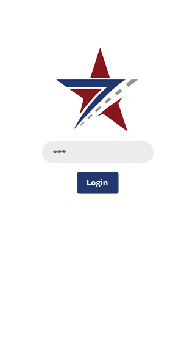
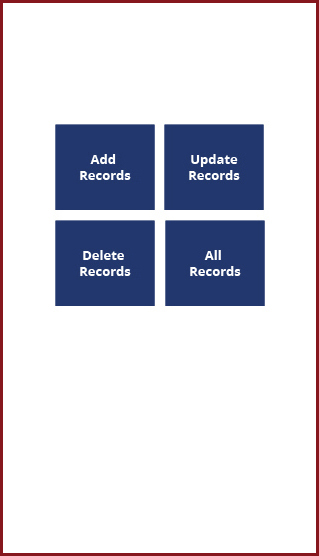
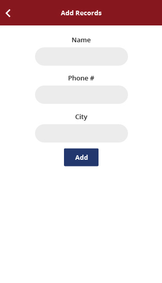

# Android
<<<<<<< HEAD
This is the collection of Android projects implemented in AndroidStudio.

# ComputerVision

ComputerVision is a simple Tesseract OCR example implemented with Gradle.

=======
This is simple CRUD operations in Android with SQLite.
>>>>>>> origin/master

# SevenStar

SevenStar is a project which simply performs CRUD operations in Android with SQLite.

## Login activity

 The password for login activity is <code>admin</code>

## Home activity

At home activity the user can perform different CRUD operations.

## Add activity

Here the user can add the customer.

