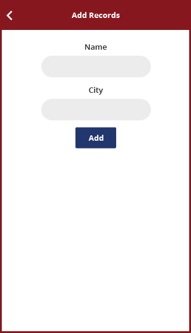

# Android
Dedicated for Android code.

## Login activity

 The password for login activity is <code>admin</code>

## Home activity

At home activity the user can perform different CRUD operations.

## Add activity

Here the user can add the customer.

